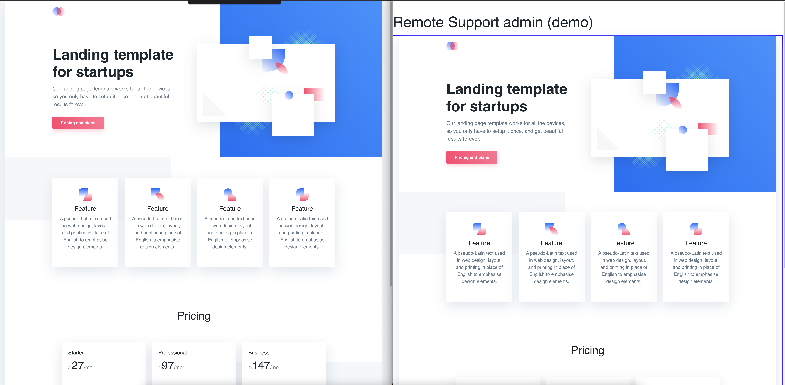

# Remote Support
This project is a demo of how you can use [Supabase](https://supabase.io) to create a remote support application.
We use Supabase channels to create a real-time communication between the client and the support agent. Supabase channels are based on Elixir Phoenix channels [https://hexdocs.pm/phoenix/channels.html](https://hexdocs.pm/phoenix/channels.html).

The rest of the app use Vercel and Vercel subscription starter.

## demo pages

### Client page
To test how you can receive help on the client page, you can use the following client page:
[https://remote-support.vercel.app/demo-page.html](https://remote-support.vercel.app/demo-page.html)

### Support page
To test how you can track the client page and simulate remote click into it, you can use the following admin page:
[https://remote-support.vercel.app/demo-page.html](https://remote-support.vercel.app/demo-page-admin.html)

### Sequence

On the following images, you can see the sequence of the demo:

On the left the User DOM is streamed to the support page on the right.

When the support click an element, the event is send to the client page and the element is highlighted and clicked.

The client DOM is updated and streamed to the support page, the support page is updated.

## Roadmap

- [ ] For Demo page add an "on mouse over" event to highlight the element hovered by the support.
- [ ] Create a loader and a small script tag to add the remote support client on a website.
- [ ] Identify the website and the user when the client is loaded.
- [ ] Make one channel by client page.
- [ ] List all user for a website on the support page (in vercel)
- [ ] Add a "support access requested" notification on the client page.
- [ ] Add a pointer on client page to show where the support is clicking.
- [ ] Limit the number of website with support based on the subscription plan.
- [ ] Create an authentication system on the channel to prevent other support to access the channel.
- [ ] Write a how to use the remote support client on the first page of the website.
- [ ] Change streaming refresh to use a more dynamic and granular approach.

## Known issues and edge cases
- Iframes
- Page reload / redirect
- Channel can be closed by another client